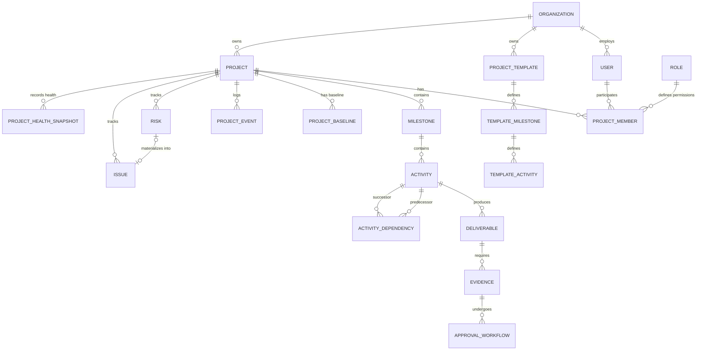

# System Architecture & Implementation Plan: Universal Project Monitoring Engine (UPME)

## 1. Executive Summary & Architectural Vision

The **Universal Project Monitoring Engine (UPME)** is a domain-agnostic, multi-tenant platform designed to monitor, track, analyze, and report project health, schedule variance, risks, issues, dependencies, and deliverables across diverse industries (education, construction, software engineering, healthcare, NGO, public sector).

The architecture adheres to **Clean Architecture / Domain-Driven Design (DDD)** principles, keeping core monitoring rules completely decoupled from industry specificities. Industry variations (e.g., School Lab Setup vs. Construction Site Prep) are captured via flexible **Project Templates**, configurable **Deliverable Evidence requirements**, and dynamic **Monitoring Policies**.

---

## 2. Architectural Blueprint (Item A)

UPME follows a **Layered Monolith with Modular Boundaries** (prepared for Microservices/Event-Driven scaling):

```
                       ┌──────────────────────────────────────────┐
                       │          React + TypeScript Frontend     │
                       │     (Redux Toolkit + RTK Query + MUI)    │
                       └────────────────────┬─────────────────────┘
                                            │ REST API / JSON:API
                                            ▼
                       ┌──────────────────────────────────────────┐
                       │             API Gateway / Routes         │
                       │        (Sanctum Auth + Middleware)       │
                       └────────────────────┬─────────────────────┘
                                            │
               ┌────────────────────────────┼────────────────────────────┐
               │                            │                            │
               ▼                            ▼                            ▼
  ┌────────────────────────┐  ┌────────────────────────┐  ┌────────────────────────┐
  │ Multi-Tenancy Layer    │  │ Domain Services        │  │ Project Health Engine  │
  │ (Tenant Context &      │  │ (Projects, Milestones, │  │ (Schedule, Budget,     │
  │ Global Scopes)         │  │ Activities, Baselines) │  │ Risk, Health Metrics)  │
  └────────────┬───────────┘  └────────────┬───────────┘  └────────────┬───────────┘
               │                            │                            │
               └────────────────────────────┼────────────────────────────┐
                                            │
                                            ▼
                       ┌──────────────────────────────────────────┐
                       │      Event Bus / Notification System     │
                       │    (Project Events & Async Jobs Queue)   │
                       └────────────────────┬─────────────────────┘
                                            │
                                            ▼
                       ┌──────────────────────────────────────────┐
                       │          Database & Storage Layer        │
                       │  (PostgreSQL / MySQL + S3 Evidence Store) │
                       └──────────────────────────────────────────┘
```

### Core Architecture Layers:
1. **Presentation Layer (Frontend)**: React 18, TypeScript, Redux Toolkit (RTK Query), Material-UI (MUI), dynamic Gantt & Dependency Graph renderers.
2. **API & Security Layer**: Laravel Routing, Sanctum bearer tokens, Tenant Isolation Middleware, Policy Enforcement.
3. **Application & Domain Services Layer**: Form Requests, Action Classes, DTOs, Domain Services (e.g., `DependencyEvaluationService`, `ProjectHealthService`, `ScheduleVarianceCalculator`).
4. **Event & Audit Trail System**: Laravel Events & Queued Listeners logging immutable `ProjectEvent` records and triggering asynchronous alerts.
5. **Persistence Layer**: Relational Database (MySQL 8+ / PostgreSQL 14+) with strict multi-tenant scoping and indexed foreign keys.

---

## 3. Core Domain Model & Entity Decisions (Items B & E)

### 3.1 Structural Hierarchy
The canonical project hierarchy is:

$$\text{Organization} \longrightarrow \text{Project} \longrightarrow \text{Milestone} \longrightarrow \text{Activity} \longrightarrow \text{Deliverable}$$

- **Organization**: The tenant boundary representing an enterprise, institution, or school district.
- **Project**: A temporary endeavor with defined baseline timelines, budget, stakeholders, and strategic objectives.
- **Milestone**: A high-level phase or major checkpoint (e.g., *Procurement*, *Room Preparation*).
- **Activity**: The fundamental unit of scheduled work, assigned to resources, bounded by start/end dates, with tracked dependencies and progress.
- **Deliverable**: A tangible output or completion artifact generated by one or more activities, optionally requiring verification/evidence.

### 3.2 Architectural Decision: `Activity` vs. `Task`
> **Decision**: `Activity` will act as the single, primary unit of tracked work in the core monitoring engine. A separate `Task` domain entity will **NOT** be created in the initial core model.

**Architectural Justification:**
1. **Avoid Over-Engineering & Cognitive Overhead**: Having both `Activity` and `Task` in a universal engine leads to ambiguous boundaries (is a dependency between tasks or activities? is progress calculated at the task level or activity level?).
2. **CPM & Dependency Granularity**: Critical Path Method (CPM) and variance calculations operate on scheduled work items with start/end dates and effort. `Activity` satisfies all CPM requirements.
3. **Sub-Item Extensibility**: For minor granular checklists within an activity, `Activity` supports a lightweight `checklist` JSON field without cluttering the relational schema or performance-heavy dependency resolution graph.

---

## 4. Entity Relationship Diagram (Item C)



---

## 5. Database Schema Specification (Item D)

Below is the DDL blueprint targeting MySQL 8.0+ / PostgreSQL 14+:

```sql
-- 1. Tenants / Organizations
CREATE TABLE organizations (
    id BIGINT UNSIGNED AUTO_INCREMENT PRIMARY KEY,
    uuid CHAR(36) UNIQUE NOT NULL,
    name VARCHAR(255) NOT NULL,
    code VARCHAR(50) UNIQUE NOT NULL,
    settings JSON NULL,
    created_at TIMESTAMP DEFAULT CURRENT_TIMESTAMP,
    updated_at TIMESTAMP DEFAULT CURRENT_TIMESTAMP ON UPDATE CURRENT_TIMESTAMP
);

-- 2. Projects
CREATE TABLE projects (
    id BIGINT UNSIGNED AUTO_INCREMENT PRIMARY KEY,
    organization_id BIGINT UNSIGNED NOT NULL,
    uuid CHAR(36) UNIQUE NOT NULL,
    code VARCHAR(50) NOT NULL,
    name VARCHAR(255) NOT NULL,
    description TEXT NULL,
    status ENUM('PLANNING', 'ACTIVE', 'ON_HOLD', 'COMPLETED', 'CANCELLED') DEFAULT 'PLANNING',
    health_status ENUM('ON_TRACK', 'WARNING', 'AT_RISK', 'CRITICAL') DEFAULT 'ON_TRACK',
    planned_start_date DATE NOT NULL,
    planned_end_date DATE NOT NULL,
    actual_start_date DATE NULL,
    actual_end_date DATE NULL,
    overall_progress DECIMAL(5,2) DEFAULT 0.00,
    created_at TIMESTAMP DEFAULT CURRENT_TIMESTAMP,
    updated_at TIMESTAMP DEFAULT CURRENT_TIMESTAMP ON UPDATE CURRENT_TIMESTAMP,
    FOREIGN KEY (organization_id) REFERENCES organizations(id) ON DELETE CASCADE,
    INDEX idx_org_status (organization_id, status)
);

-- 3. Milestones
CREATE TABLE milestones (
    id BIGINT UNSIGNED AUTO_INCREMENT PRIMARY KEY,
    project_id BIGINT UNSIGNED NOT NULL,
    name VARCHAR(255) NOT NULL,
    order_index INT UNSIGNED DEFAULT 0,
    planned_start_date DATE NOT NULL,
    planned_end_date DATE NOT NULL,
    actual_start_date DATE NULL,
    actual_end_date DATE NULL,
    progress DECIMAL(5,2) DEFAULT 0.00,
    status ENUM('PENDING', 'IN_PROGRESS', 'COMPLETED', 'DELAYED') DEFAULT 'PENDING',
    created_at TIMESTAMP DEFAULT CURRENT_TIMESTAMP,
    updated_at TIMESTAMP DEFAULT CURRENT_TIMESTAMP ON UPDATE CURRENT_TIMESTAMP,
    FOREIGN KEY (project_id) REFERENCES projects(id) ON DELETE CASCADE
);

-- 4. Activities (The core work unit)
CREATE TABLE activities (
    id BIGINT UNSIGNED AUTO_INCREMENT PRIMARY KEY,
    project_id BIGINT UNSIGNED NOT NULL,
    milestone_id BIGINT UNSIGNED NOT NULL,
    name VARCHAR(255) NOT NULL,
    description TEXT NULL,
    status ENUM('NOT_STARTED', 'IN_PROGRESS', 'BLOCKED', 'COMPLETED', 'CANCELLED') DEFAULT 'NOT_STARTED',
    planned_start_date DATE NOT NULL,
    planned_end_date DATE NOT NULL,
    actual_start_date DATE NULL,
    actual_end_date DATE NULL,
    planned_duration_days INT UNSIGNED NOT NULL,
    actual_duration_days INT UNSIGNED NULL,
    progress DECIMAL(5,2) DEFAULT 0.00,
    is_critical_path BOOLEAN DEFAULT FALSE,
    assigned_to_user_id BIGINT UNSIGNED NULL,
    checklist JSON NULL,
    created_at TIMESTAMP DEFAULT CURRENT_TIMESTAMP,
    updated_at TIMESTAMP DEFAULT CURRENT_TIMESTAMP ON UPDATE CURRENT_TIMESTAMP,
    FOREIGN KEY (project_id) REFERENCES projects(id) ON DELETE CASCADE,
    FOREIGN KEY (milestone_id) REFERENCES milestones(id) ON DELETE CASCADE
);

-- 5. Activity Dependencies
CREATE TABLE activity_dependencies (
    id BIGINT UNSIGNED AUTO_INCREMENT PRIMARY KEY,
    project_id BIGINT UNSIGNED NOT NULL,
    predecessor_activity_id BIGINT UNSIGNED NOT NULL,
    successor_activity_id BIGINT UNSIGNED NOT NULL,
    dependency_type ENUM('FS', 'SS', 'FF', 'SF') DEFAULT 'FS',
    lag_days INT DEFAULT 0,
    created_at TIMESTAMP DEFAULT CURRENT_TIMESTAMP,
    FOREIGN KEY (project_id) REFERENCES projects(id) ON DELETE CASCADE,
    FOREIGN KEY (predecessor_activity_id) REFERENCES activities(id) ON DELETE CASCADE,
    FOREIGN KEY (successor_activity_id) REFERENCES activities(id) ON DELETE CASCADE,
    UNIQUE KEY uk_pred_succ (predecessor_activity_id, successor_activity_id)
);

-- 6. Deliverables & Evidence
CREATE TABLE deliverables (
    id BIGINT UNSIGNED AUTO_INCREMENT PRIMARY KEY,
    activity_id BIGINT UNSIGNED NOT NULL,
    title VARCHAR(255) NOT NULL,
    requires_evidence BOOLEAN DEFAULT TRUE,
    status ENUM('PENDING', 'SUBMITTED', 'APPROVED', 'REJECTED') DEFAULT 'PENDING',
    created_at TIMESTAMP DEFAULT CURRENT_TIMESTAMP,
    FOREIGN KEY (activity_id) REFERENCES activities(id) ON DELETE CASCADE
);

CREATE TABLE evidence (
    id BIGINT UNSIGNED AUTO_INCREMENT PRIMARY KEY,
    deliverable_id BIGINT UNSIGNED NOT NULL,
    uploaded_by_user_id BIGINT UNSIGNED NOT NULL,
    file_path VARCHAR(1024) NOT NULL,
    file_type VARCHAR(50) NOT NULL,
    file_size INT UNSIGNED NOT NULL,
    notes TEXT NULL,
    created_at TIMESTAMP DEFAULT CURRENT_TIMESTAMP,
    FOREIGN KEY (deliverable_id) REFERENCES deliverables(id) ON DELETE CASCADE
);

-- 7. Risks & Issues
CREATE TABLE risks (
    id BIGINT UNSIGNED AUTO_INCREMENT PRIMARY KEY,
    project_id BIGINT UNSIGNED NOT NULL,
    title VARCHAR(255) NOT NULL,
    probability ENUM('LOW', 'MEDIUM', 'HIGH') NOT NULL,
    impact ENUM('LOW', 'MEDIUM', 'HIGH') NOT NULL,
    severity_score INT UNSIGNED NOT NULL,
    mitigation_plan TEXT NULL,
    status ENUM('IDENTIFIED', 'MITIGATED', 'MATERIALIZED', 'CLOSED') DEFAULT 'IDENTIFIED',
    created_at TIMESTAMP DEFAULT CURRENT_TIMESTAMP
);

CREATE TABLE issues (
    id BIGINT UNSIGNED AUTO_INCREMENT PRIMARY KEY,
    project_id BIGINT UNSIGNED NOT NULL,
    risk_id BIGINT UNSIGNED NULL,
    title VARCHAR(255) NOT NULL,
    severity ENUM('LOW', 'MEDIUM', 'HIGH', 'CRITICAL') NOT NULL,
    description TEXT NOT NULL,
    resolution TEXT NULL,
    status ENUM('OPEN', 'IN_PROGRESS', 'RESOLVED', 'CLOSED') DEFAULT 'OPEN',
    created_at TIMESTAMP DEFAULT CURRENT_TIMESTAMP,
    FOREIGN KEY (risk_id) REFERENCES risks(id) ON DELETE SET NULL
);

-- 8. Audit Trail / Project Events
CREATE TABLE project_events (
    id BIGINT UNSIGNED AUTO_INCREMENT PRIMARY KEY,
    project_id BIGINT UNSIGNED NOT NULL,
    user_id BIGINT UNSIGNED NULL,
    event_type VARCHAR(100) NOT NULL,
    payload JSON NOT NULL,
    created_at TIMESTAMP DEFAULT CURRENT_TIMESTAMP,
    FOREIGN KEY (project_id) REFERENCES projects(id) ON DELETE CASCADE
);
```

---

## 6. Dependency Model & Delay Propagation (Item F)

### 6.1 Dependency Types
UPME supports four dependency constraints:
- **FS (Finish-to-Start)**: Predecessor must complete before Successor can begin. *(Default for MVP)*.
- **SS (Start-to-Start)**: Successor cannot start until Predecessor starts.
- **FF (Finish-to-Finish)**: Successor cannot finish until Predecessor finishes.
- **SF (Start-to-Finish)**: Successor cannot finish until Predecessor starts.

### 6.2 Cycle Detection & Propagation Algorithm
- **Cycle Detection**: Handled via Directed Acyclic Graph (DAG) validation using **Kahn's Algorithm** or Depth-First Search (DFS) prior to inserting any `activity_dependency`.
- **Delay Propagation Engine**:
  $$\text{Expected Start}(\text{Successor}) = \max\left(\text{Planned Start}, \text{Actual Completion}(\text{Predecessor}) + \text{Lag Days}\right)$$
  When an activity's completion is updated with a delay:
  1. The `DependencyEvaluationService` identifies all immediate successor activities.
  2. It recalculates their expected start dates.
  3. If a successor is delayed, it marks downstream activities as `BLOCKED` and flags milestone schedule variance.
  4. An alert event `DEPENDENCY_BLOCKAGE_DETECTED` is emitted.

---

## 7. Multi-Tenancy Strategy (Item G)

> **Strategy Choice**: Discriminator Column Multi-tenancy (`organization_id`) combined with Laravel **Eloquent Global Scopes** & Tenant Context Middleware.

### Tenant Isolation Architecture:
1. **Tenant Middleware**: Resolves the tenant from JWT claims or HTTP request headers (`X-Organization-Id`) and sets `TenantContext::setOrganization($org)`.
2. **Global Tenant Scope**: Every database query automatically applies `WHERE organization_id = tenant_id`.
3. **Storage Isolation**: Evidence files stored on S3/local object store use tenant-isolated key paths:
   `storage/tenants/{organization_uuid}/projects/{project_uuid}/evidence/{file_name}`.

---

## 8. Deterministic Project Health Engine (Item H)

The **Project Health Engine** produces an overall quantitative health score $H \in [0, 100]$ based on a weighted composite across 5 primary dimensions:

$$H = w_{s} \cdot S_{\text{schedule}} + w_{p} \cdot S_{\text{progress}} + w_{r} \cdot S_{\text{risk}} + w_{i} \cdot S_{\text{issue}} + w_{d} \cdot S_{\text{deliverable}}$$

Where default weights sum to $1.0$:
- **Schedule Variance Score ($S_{\text{schedule}}$)**: Weight $w_s = 0.30$. Evaluated by comparing Actual Progress vs. Baseline Planned Progress at the current timestamp.
- **Progress Rate ($S_{\text{progress}}$)**: Weight $w_p = 0.25$. Ratio of completed activities to total planned activities up to today.
- **Issue Impact Score ($S_{\text{issue}}$)**: Weight $w_i = 0.20$. Penalizes active `CRITICAL` (-25 pts) and `HIGH` (-10 pts) issues.
- **Risk Exposure Score ($S_{\text{risk}}$)**: Weight $w_r = 0.15$. Penalizes unmitigated high-severity risks.
- **Deliverable Approval Score ($S_{\text{deliverable}}$)**: Weight $w_d = 0.10$. Percentage of expected deliverables approved.

### Health Status Classification:
- **90 - 100**: `ON_TRACK` (Green)
- **75 - 89**: `WARNING` (Yellow)
- **50 - 74**: `AT_RISK` (Orange)
- **0 - 49**: `CRITICAL` (Red)

---

## 9. REST API Resource Structure (Item I)

Following RESTful standard conventions and JSON envelope formatting:

| HTTP Method | Endpoint Path | Description |
| :--- | :--- | :--- |
| `POST` | `/api/v1/auth/login` | Authenticate & obtain token |
| `GET` | `/api/v1/projects` | List tenant projects (filtered/paginated) |
| `POST` | `/api/v1/projects` | Create new project from baseline or template |
| `GET` | `/api/v1/projects/{uuid}` | Detailed project view with milestones |
| `GET` | `/api/v1/projects/{uuid}/health` | Retrieve real-time health score breakdown |
| `GET` | `/api/v1/projects/{uuid}/gantt` | Gantt chart timeline & dependency data |
| `POST` | `/api/v1/activities/{id}/progress` | Update activity progress & trigger propagation |
| `POST` | `/api/v1/dependencies` | Create activity dependency link |
| `POST` | `/api/v1/deliverables/{id}/evidence` | Upload evidence file |
| `POST` | `/api/v1/evidence/{id}/approve` | Approve/Reject deliverable evidence |
